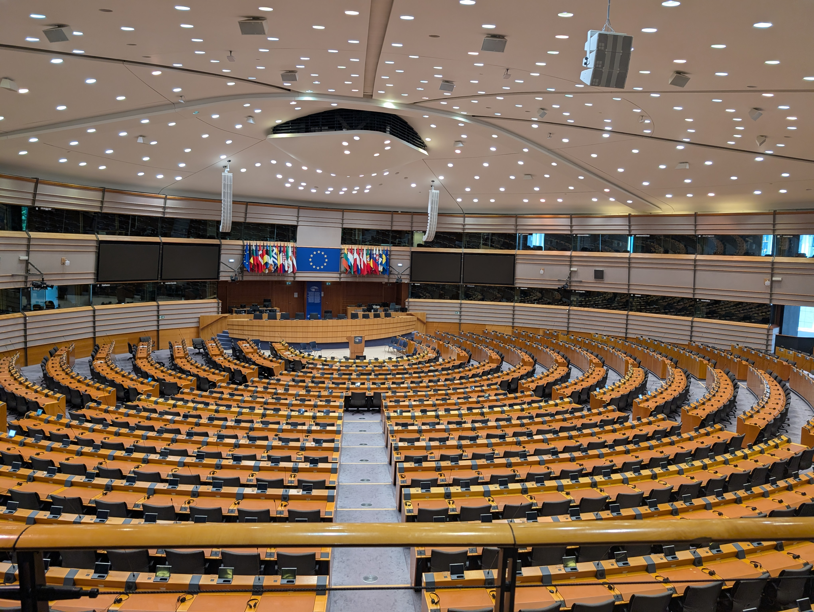

   
## First Week of the Dialogue

This dialogue has been an excellent experience so far and I'm grateful for the opportunity. Through visits to the European Parliament, the European Commission, and the EEAS I learned a lot about how the EU operates and the role computer science plays in governance. Belgium is a beautiful country too, everything here is really picturesque and the food is great. It's been a lot of fun exploring Brussels and Leuven, I can't wait to see more of the country.

### Phase 1 Deliverables

For phase one of the deliverables I evaluated data sources for our election turnout and EU trust machine learning models. I pulled some data from Eurostat, the World Bank, and EU barometer survey and wrote some Python to make sure that the APIs were publically accessible and returning real data.

