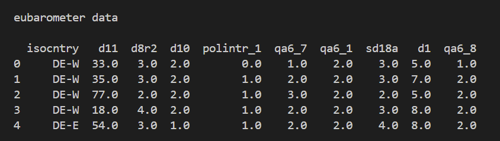

# Project Description

Many EU citizens, especially younger students, struggle to understand how the European Union’s elections and political decision-making processes work. Information about the EU can be complex and difficult to navigate, and is often presented in ways that are not engaging for students. Our group aims to build an educational platform inspired by learning systems such as Canvas that helps students learn about the EU through modules and assessments. Teachers will be able to create and assign modules on topics such as EU elections, the European Parliament, citizens’ rights, and policymaking, while parents can monitor their children’s progress in a separate parent view.

To enhance the learning experience, our platform will include two machine learning models trained on real datasets. Students will be able to input hypothetical data to build their own EU country and discover its predicted European Parliament election turnout levels. This model will use demographic and political indicators from EU countries to help learners understand factors that influence election participation. A second model will predict trust in EU institutions based on factors such as age, education, country of origin, and satisfaction with democracy. Students can take a diagnostic survey to determine the level of trust in the EU held by people who are similar to them. This will help achieve our goal of bolstering peoples' understanding of and engagement with European political systems.

## Data Description
 
 We have data from three major sources: Eurostat, the World Bank, and eurobarometer. The eurostat and world bank data is mostly numeric and contains general summary statistics such as population, population density, GDP per capita, Urban population percentage, and tertiary education rates. Eurobarometer has categorical data of the public's opinion on the EU and their home countries. It contains data such as satisfaction with the EU, satisfaction with national government, and satisfaction with democracy. I wrote a python script to analyze our sources and have pasted some the script's output below.

 
 

## Vineeth's Contribution
I contributed to the project’s phase one deliverable by developing ideas for our machine learning models and writing the project description.

## Meghan's Contribution

## Sidra's Contribution

